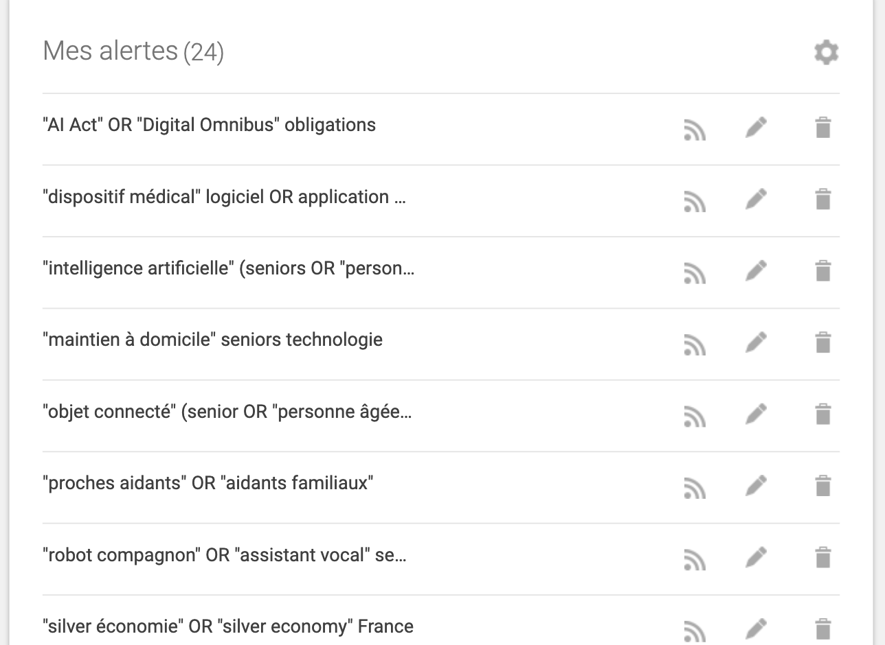
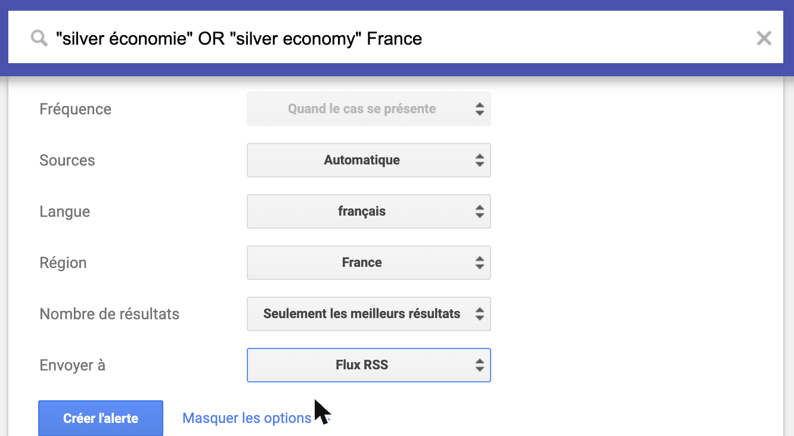

# Annexe — Dispositif de veille « Marché & réglementation silver tech »

Projet fil rouge · Ynov B2 Product Builder No-Code · PFR Générations Connectées · Phase 1
Compétence visée : RNCP C.1.1.1 « Mettre en place un système de veille ».

## 1. Objectif

Alimenter la fiche de veille sur les objets connectés pour seniors achetés par leurs enfants aidants,
avec des informations **sourcées, datées, notées et validées par un humain**.
Principe : **beaucoup d'entrées, peu de sorties**. On collecte large, on filtre sans IA, on qualifie avec IA, l'humain décide.

Ce que l'on cherche est défini à l'avance dans un **catalogue de 32 types d'information** (`config/catalogue.yaml`),
répartis en 5 axes : marché (M1-M7), concurrence (C1-C7), usagers (U1-U5), technologie (T1-T5), réglementaire (R1-R8).
13 sont **requis** pour la phase 1, les autres sont des bonus utiles aux phases suivantes.

## 2. Sources

| Famille | Sources | Mode | Fréquence |
|---|---|---|---|
| Médias spécialisés (RSS) | Silvereco, Maddyness, FrenchWeb | flux RSS testés | hebdomadaire |
| Régulateur (RSS) | CNIL | flux RSS | hebdomadaire |
| Google Alerts (RSS) | 24 alertes : 13 du catalogue (01/10/2026) + 11 de la veille du jeudi (02/10/2026, 3 par axe) | flux RSS, français | au fil de l'eau côté Google, relevé chaque jeudi |
| Communautés (RSS) | r/nocode ; r/AgingParents et r/CaregiverSupport (validés par l'équipe le 01/10/2026 : seule source donnant la voix des aidants) | flux RSS publics de Reddit | hebdomadaire |
| Avis d'applications | App Store : Famileo, Tous FAMiliés, Life360, Signia | flux public d'avis Apple | hebdomadaire |
| Avis Google Play | fiches Play Store | **saisie manuelle** (pas d'API gratuite, pas de scraping) | ponctuelle |
| Recherche web ciblée | 2-3 requêtes par code (`config/sources.yaml`), priorité aux sites officiels : aidants.fr, pour-les-personnes-agees.gouv.fr, ansm.sante.fr, eur-lex.europa.eu, insee.fr, DREES | agent collecteur | hebdomadaire, sur les codes sous-couverts |
| Données entreprises | pappers.fr, societe.com, crunchbase.com | consultation ciblée (C1, C4), jamais d'extraction massive | ponctuelle |

### Google Alerts de la veille du jeudi

12 alertes, 3 par axe, réglées en **français, région France, meilleurs résultats, livraison par flux RSS**. Avec un flux RSS, Google impose la fréquence « Quand le cas se présente » : la veille relit les flux chaque jeudi sur les 7 derniers jours. Les adresses des flux sont dans `config/sources.yaml` et dans la base (`veille_config`, clé `flux_rss_google_alerts`).

| # | Axe | Requête | État |
|---|---|---|---|
| 1 | Marché | `"silver économie" OR "silver economy" France` | créée le 02/10/2026 |
| 2 | Marché | `"proches aidants" OR "aidants familiaux"` | créée le 02/10/2026 |
| 3 | Marché | `"maintien à domicile" seniors technologie` | créée le 02/10/2026 |
| 4 | Concurrence | `téléassistance OR "détection de chute" seniors` | alerte existante réutilisée |
| 5 | Concurrence | `"objet connecté" (senior OR "personne âgée") -emploi` | créée le 02/10/2026 |
| 6 | Concurrence | `Famileo OR "Présence Verte" OR Vitaris OR Filien` | créée le 02/10/2026 |
| 7 | Concurrence | `Telegrafik OR "Otono-me" OR "Veiller sur mes parents"` | créée le 02/10/2026 |
| 8 | Techno | `"intelligence artificielle" (seniors OR "personnes âgées")` | créée le 02/10/2026, **plus lue** (IA hors périmètre) |
| 9 | Techno | `"robot compagnon" OR "assistant vocal" senior` | créée le 02/10/2026 |
| 10 | Réglementaire | `site:cnil.fr "données de santé"` | créée le 02/10/2026 |
| 11 | Réglementaire | `"AI Act" OR "Digital Omnibus" obligations` | créée le 02/10/2026 |
| 12 | Réglementaire | `"dispositif médical" logiciel OR application ANSM` | créée le 02/10/2026 |

## 3. Outils

- **Claude Code** : orchestrateur, avec 3 sous-agents (collecteur, qualificateur, rapporteur) et 4 commandes (`/veille`, `/revue`, `/couverture`, `/export-fiche`).
- **Python** : scripts de collecte, de filtrage, de calcul du score et de rendu (aucune API payante).
- **Neon (PostgreSQL)** : base partagée par l'équipe (tables `catalogue`, `raw_items`, `veille_items`, `runs`).
- **Rapport HTML** statique hebdomadaire, lisible sur téléphone.

## 4. Méthode

### 4.1 Collecte

Les scripts lisent les flux RSS et les avis App Store. L'agent collecteur lance les recherches web
des codes **sous-couverts** (moins de 3 éléments validés). Tout arrive dans `raw_items`, dédoublonné par URL.
L'agent collecteur ne résume rien et ne juge rien.

### 4.2 Filtrage sans IA (`scripts/prefilter.py`, règles dans `config/regles.yaml`)

1. Domaine exclu (Facebook, Instagram, TikTok, Pinterest) : rejet.
2. Aucun mot-clé d'inclusion (senior, aidant, téléassistance, chute, EHPAD, CNIL, RGPD, AI Act…) : rejet.
   Les avis d'applications et les résultats de recherche web ciblée en sont dispensés (voir § 6).
3. Titre déjà vu sur les 30 derniers jours : rejet (doublon de reprise).
4. Publication de plus de 36 mois : rejet, sauf réglementaire (code R* ou domaine officiel).

Chaque rejet garde son motif, ce qui permet de vérifier que le filtre ne jette pas de bonnes sources.

### 4.3 Qualification par IA (agent qualificateur)

Pour chaque élément retenu, l'agent lit la page et remplit les champs de la base de veille du cours :
titre, résumé reformulé (3 lignes max), pourquoi c'est important pour le projet, axe, code du catalogue,
pertinence proposée (1-3). Il précise aussi : fait ou signal, archétype de produit, chiffres **avec leur source citée**,
source primaire, et les marqueurs « sensible » (santé) et « éthique » (autonomie / surveillance, consentement).
Pour les signaux d'usagers, il note l'irritant et un verbatim anonymisé.

**Garde-fous automatiques** (`scripts/save_qualified.py`) : le script retélécharge la page et **retire tout chiffre
ou lien de source primaire qu'il n'y retrouve pas**. Il tronque et nettoie les verbatims.

### 4.4 Score de fiabilité (par script, jamais par l'IA)

| Critère | Points |
|---|---|
| Autorité du domaine | 3 officiel (gouv.fr, europa.eu, CNIL, INSEE, HAS, ANSM…) · 2 média reconnu · 1 autre · 0 exclu |
| Fraîcheur | 2 si ≤ 12 mois · 1 si ≤ 24 mois · 0 au-delà ou non daté · 2 pour un texte réglementaire officiel |
| Source primaire citée et vérifiée | 2 si officielle · 1 sinon · 0 si absente |

Total sur 7 : **≥ 5 prioritaire**, 3-4 à vérifier, < 3 relégué en fin de rapport.
Les **signaux** (vécu d'usagers) ne sont pas notés : ils pèsent par leur **récurrence**, c'est-à-dire le nombre d'occurrences d'un même irritant.

### 4.5 Revue humaine et exploitation

Chaque semaine, un membre de l'équipe valide ou rejette les éléments (`/revue`), fixe la pertinence finale
et signe de son prénom. Seuls les éléments validés partent dans la fiche (`/export-fiche`, avec bibliographie numérotée).
`/couverture` montre les **trous** du catalogue, qui orientent la collecte suivante.

## 5. Fréquence

| Quand | Quoi | Durée |
|---|---|---|
| Lundi | `/veille` (collecte, filtre, qualification, rapport) | ≈ 15 min, surtout automatique |
| Dans la semaine | `/revue` par axe, répartie dans l'équipe | ≈ 20 min par personne |
| Avant un rendu | `/couverture` puis `/export-fiche` | ≈ 10 min |

Chaque exécution est journalisée dans la table `runs` (date, volumes par origine, filtrés, qualifiés, hors sujet,
modèle d'IA, durée) : c'est la preuve du fonctionnement du dispositif.

## 6. Limites connues

- **Biais de sources** : les médias suivis sont surtout français et orientés start-up ; les communautés Reddit
  d'aidants sont anglophones (pas de communauté française assez active trouvée).
- **Recherche web** : l'outil ne renvoie que des titres, sans date. Beaucoup d'éléments sont donc « non datés »
  (fraîcheur 0) tant que la date n'est pas retrouvée. Pour la même raison, ces résultats ciblés sont dispensés du filtre par mots-clés.
- **Avis d'applications** : seulement l'App Store, et seulement les avis récents exposés par le flux d'Apple.
  Google Play reste manuel.
- **Score** : il mesure la fiabilité de la *source*, pas la vérité de l'information. Un média reconnu peut se tromper.
- **Google Alerts** : une alerte ne remonte que les contenus publiés après sa création (01/10/2026). Elle ne rattrape pas l'historique, d'où la recherche web ciblée en complément. Les alertes sont rattachées au compte Google de Lucas.
- **IA** : malgré les garde-fous, un résumé peut mal interpréter une page. C'est pourquoi rien n'entre dans la fiche
  sans validation humaine.

## 7. Usage de l'IA (déclaration)

| Étape | IA ? | Rôle |
|---|---|---|
| Collecte RSS, avis, filtrage | non | scripts déterministes |
| Recherche web | oui | l'agent lance les requêtes définies par l'équipe et rapporte les liens, sans jugement |
| Qualification | oui | classement, résumé reformulé, extraction de chiffres sourcés |
| Score de fiabilité | **non** | calcul par script, règles publiques dans `config/regles.yaml` |
| Synthèse hebdomadaire | oui | marquée « à vérifier », chaque affirmation renvoie à un élément de la base |
| Validation | **non** | décision humaine, signée |

Modèle utilisé et volumes traités : table `runs`, reprise dans chaque rapport.
